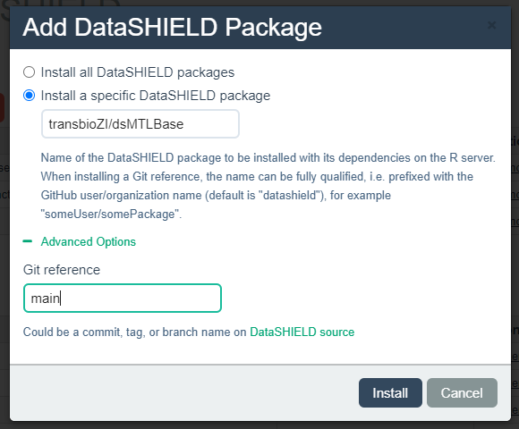

# dsMTLBase: dsMTL server site functions
dsMTL (Federated Multi-Task Learning based on DataSHIELD) provided federated, privacy-preserving MTL analysis. dsMTL was developed for DataSHIELD, a platform supporting the federated analysis of sensitive individual-level data that remains stored behind the data owner’s firewall throughout analysis. Federated machine learning assumed the data of each geo-distributed cohort can be seen as drawn from the identical distribution, which was too strong in fields i.e. molecular biology. Federated multi-task learning relaxed the assumption that the data distribution of geo-distributed cohorts were only required to share common properties.  The aim of dsMTL was to account for the heterogeneity of the geo-distributed data cohorts by the cross-task regularization particularly in applications of molecular studies. 

dsMTL currently includes three supervised and one unsupervised federated multi-task learning algorithms. Specifically, the **dsMTL_L21** approach allows for screening out unimportant features to all tasks. The **dsMTL_trace** approach constrains the models’ representation in a low-dimensional space during the training procedure, in order to penalize the complexity of task-relationships, resulting in an improved generalizability of the models. **dsMTL_net** incorporates the task-relationships that can be described as a graph, in order to incorporate the domain koowledge. The **dsMTL_iNMF** approach is an unsupervised, integrative non-negative matrix factorization method that aims at factorizing the cohorts’ data matrices into homogeneous (i.e. shared across all datasets) and heterogeneous (i.e. specific to any given dataset) components. In addition to the FeMTL methods, we also included in dsMTL a federated implementation of the conventional Lasso (**dsLasso**) due to its wide usage in biomedicine.

<p align="center"> 
​
</p>


# Installation
## Requirements
dsMTLBase was successfully tested with these server-side softwares
```
Opal 3.0.3
dsBase 6.1.0
resourcer 1.0.1
R >= 3.5.0
```

## Install dsMTLBase on the DataSHIELD (or opal) server

### Install an opal server 

* Install a well-configured server using Virtualbox. This [training course](https://data2knowledge.atlassian.net/wiki/spaces/DSDEV/pages/931069953/Installation+Training+Hub+-+DataSHIELD+v6.1) was provided by DataSHIELD  team
* Install and configure opal server from scratch. This is from the [doccument](https://opaldoc.obiba.org/en/latest/admin/installation.html) of opal server
* Quick test using the [opal test server](https://opal-test.obiba.org). Please note this server was upgraded frequently so it might not work (see the suooprted opal server above)
    1. username: administrator
    1. password: password

### Install package dsMTLBase

* Install using DataSHIELD web-GUI on Client computer
    1. The entire tutorial can be found [here](https://isglobal-brge.github.io/resource_bookdown/tips-and-tricks.html#how-to-install-datashield-packages-into-opal-server)
    1. After login of web-GUI, go to "Administration -> DataSHIELD -> Add Package". In the dialog, selected the installation from github, and then filled with the repository information, i.e. organization name: transbioZI; package name: dsMTLBase; git branch: main 
<p align="center"> 
​
</p>

* Install using command line on Client computer
    1. Be sure your DataSHIELD server account has administration permision
    2. Install R opal management package opalr
        ```shell
        install.packages("opalr")
        ```
    4. Perform these on shell command line
    ```shell
    git clone https://github.com/transbioZI/dsMTLBase.git
    cd dsMTLBase
    # open ./inst/uploadFunctions.R, change the server information to yours (server IP, user name and passowrd)
    Rscript ./inst/uploadFunctions.R
    ```


# Contact
Han Cao (hank9cao@gmail.com)
