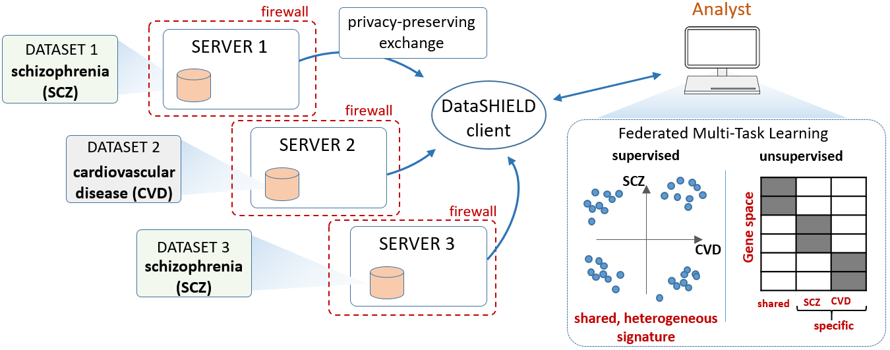

# dsMTLBase: dsMTL server site functions
dsMTL (Federated Multi-Task Learning based on DataSHIELD) provided federated, privacy-preserving MTL analysis. dsMTL was developed based on DataSHIELD, an ecosystem supporting the federated analysis of sensitive individual-level data that remains stored behind the data owner’s firewall throughout analysis. Multi-task Learning (MTL) aimed at simultaneously learning the outcome (e.g. diagnosis) associated patterns across datasets with dataset-specific, as well as shared, effects. MTL has numerous exciting application areas, such as comorbidity modeling, and has already been applied successfully for e.g. disease progression analysis.  

<p align="center"> 
​
</p>


dsMTL currently includes three supervised and one unsupervised federated multi-task learning as well as one federated machine learning algorithms. Each algorithm captured a specific form of cross-cohort heterogeneity, which was linked to different applications in molecular studies.

| Name  | Type | Task | Effect |
| --- | --- | --- | --- |
| `dsLasso`  | ML | Classification/Regression | Train a Lasso model on the conbained cohorts |
| `dsMTL_L21`  | MTL | Classification/Regression | Screen out unimportant features to all tasks |
| `dsMTL_trace`  | MTL | Classification/Regression | Identify models represented in low-dimentional spcae |
| `dsMTL_net`  | MTL | Classification/Regression | Incorporate task-relatedness described as a graph |
| `dsMTL_iNMF`  | MTL | Matrix factorization | Factorize matrices into shared and specific components |

# Client-side Package of dsMTL

The Client-side package can be found：[dsMTLClient](https://github.com/transbioZI/dsMTLClient)


# Installation

To enable dsMTLBase functions, the DataSHIELD server has to be installed first. dsMTLBase can be installed smoothly based on DataSHIELD server in several ways.

## Requirements
dsMTLBase was tested on the dependent softwares with minimum versions
```
Opal 3.0.3
dsBase 6.1.0
resourcer 1.0.1
R >= 3.5.0
```

## Install an DataSHIELD server 

The complete document for describing the installation of DataSHIELD server from scratch was [here](https://opaldoc.obiba.org/en/latest/admin/installation.html). Alternatively, to test dsMTL functions, one was recommonded to dowload a [well-configured DataSHIELD server](https://data2knowledge.atlassian.net/wiki/spaces/DSDEV/pages/931069953/Installation+Training+Hub+-+DataSHIELD+v6.1) and install locally using Virtualbox. This tutorial was provided by DataSHIELD  team. A quick test of dsMTLBase installation is possible based on [opal demo server](https://opal-demo.obiba.org/ui/index.html#!dashboard). This is an open server for testing DataSHIELD-derived functions, and will be regularly reset everyday. (username: administrator, password: password)


## Install dsMTLBase

There are two ways to install dsMTLBase on a well-configured DataSHIELD server. With an administrator account, one could login the backend administration page from the web-browser, and let DataSHIELD server yield dsMTLBase codes from github directly. Alternatively, one could use the [script](https://github.com/transbioZI/dsMTLBase/blob/main/inst/uploadFuntions.R) to upload the dsMTLBase functions from the local computer. To use the script successfully, please fill your username, password and server IP in the top lines of the script.  

#### Using DataSHIELD backend administration page 
 
The entire tutorial can be found [here](https://isglobal-brge.github.io/resource_bookdown/tips-and-tricks.html#how-to-install-datashield-packages-into-opal-server). After the login of the administration page, go to "Administration -> DataSHIELD -> Add Package". In the dialog (as shown below), filled with the repository information of dsMTLBase on github ( organization name: transbioZI; package name: dsMTLBase; git branch: main ).
<p align="center"> 
​
</p>

#### Using R scripts

1, Install DataSHIELD server management package opalr in R
```r
  install.packages("opalr")
```
2, Download dsMTLBase sources from github in shell
```shell
  git clone https://github.com/transbioZI/dsMTLBase.git
  cd dsMTLBase
  gedit ./inst/uploadFuntions.R
```
3, Change the server information to yours (server IP, user name and passowrd) and run
```shell
  Rscript ./inst/uploadFunctions.R
```

# Data upload, import and management

For small-scale and uncompressed datasets, it is recommended to upload and import directly into DataSHIELD. Check ["Management data in Opal"](https://data2knowledge.atlassian.net/wiki/spaces/DSDEV/pages/12943477/Opal+management#Opalmanagement-DataSHIELDAdministration) for detail tutorial. For large-scale and compressed datasets, i.e. *.rda files in R,  it is recommended to attach the data sources using the R package [resources](https://opaldoc.obiba.org/en/latest/resources.html). The tutorial can be found [here](https://rpubs.com/jrgonzalezISGlobal/tutorial_resources)


# Contact
Han Cao (hank9cao@gmail.com)
